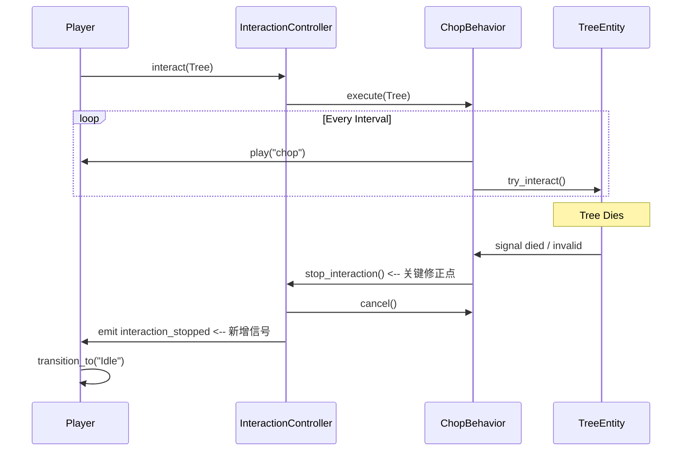

# 交互系统修复方案 (最小化修改)

## 1. 概述
本方案旨在解决交互结束后角色动画未恢复的问题，同时保持现有的组件调用关系不变。

## 2. 修改目标
1.  **InteractionController**: 向外广播交互停止信号，供 Player/NPC 监听。
2.  **ChopBehavior**: 确保所有停止路径都经过控制器，从而触发信号。
3.  **Player/HumanNPC**: 监听信号并在交互结束时重置动画。

## 3. 详细变更

### 3.1 InteractionController.gd
*   **新增信号**: `signal interaction_stopped`
*   **修改方法**: `stop_interaction()`
    *   在调用 `current_behavior.cancel()` 后，发射 `interaction_stopped` 信号。

### 3.2 ChopBehavior.gd
*   **修改方法**: `_perform_chop()`
    *   当 `!is_instance_valid(_current_target)` 时，改为调用 `interaction_controller.stop_interaction()`（原为直接调用内部 `_stop_chopping()`）。
    *   当 `!_is_in_range` 时，确保调用 `interaction_controller.stop_interaction()`。
*   **修改方法**: `_on_target_lost()`
    *   确保调用 `interaction_controller.stop_interaction()`。

### 3.3 Player.gd & HumanNPC.gd
*   **新增监听**: 在 `_setup_components` 中连接 `interaction_controller.interaction_stopped` 信号。
    *   回调: `animation_controller.transition_to("Idle")`
*   **清理**: 移除 `command_interact` 方法中不经过控制器的后备逻辑。

## 4. 交互时序图 (Fix Flow)

